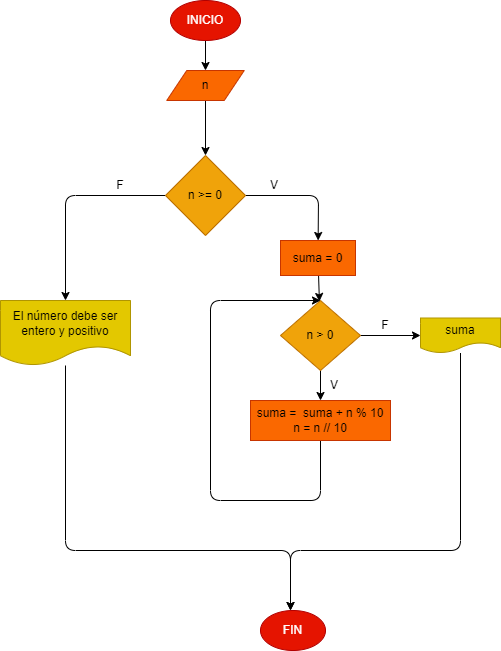

# Hacer el diagrama de flujo y programa en python que lea el número , entero y positivo, de cualquier número de digitos , que calcule la suma de sus digitos y que la imprima con el número leido.

# Analisis

## Diagrama de flujo.
